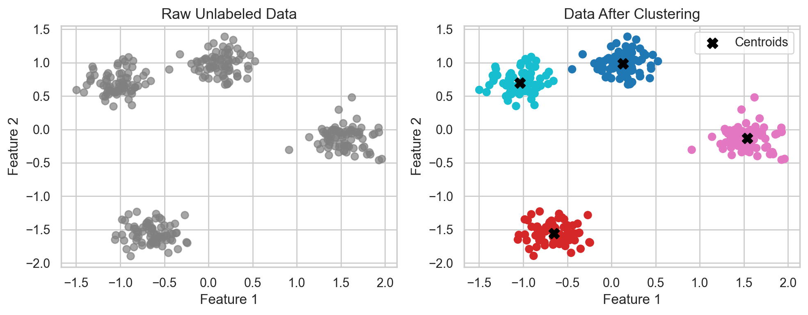
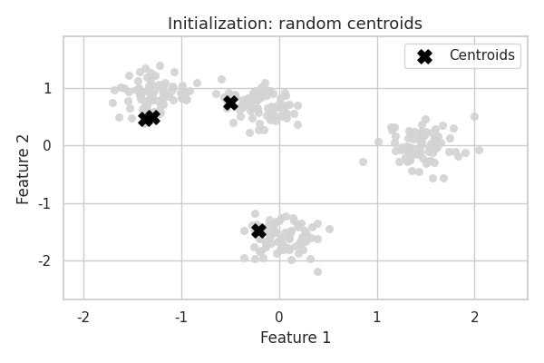
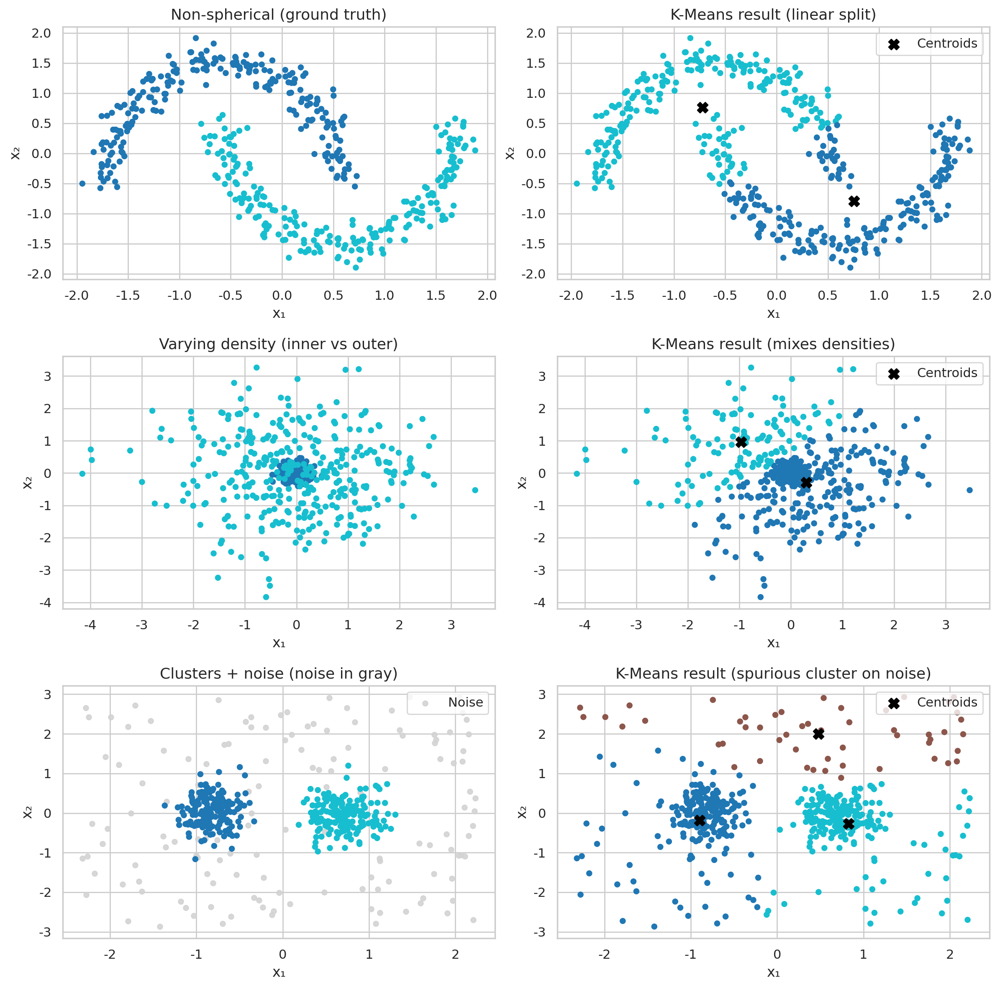
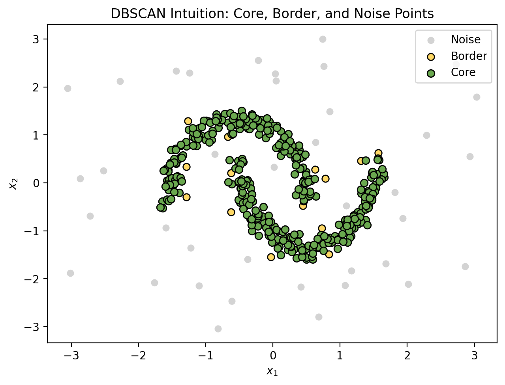
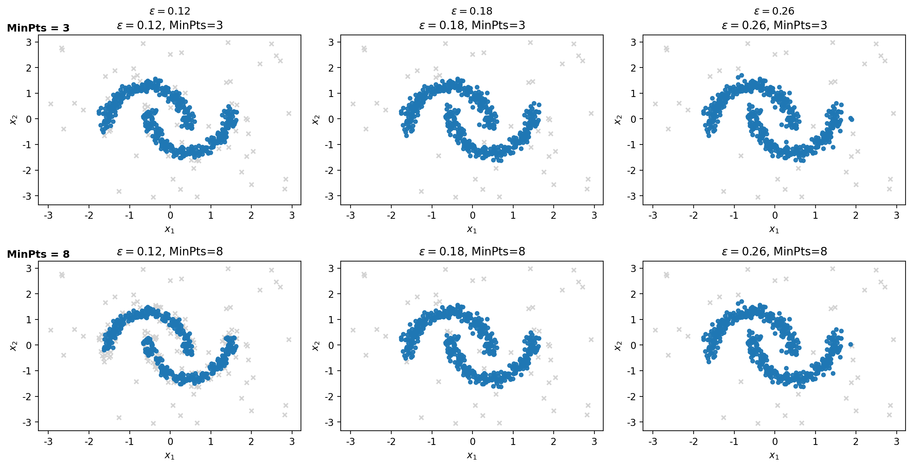

# 🧠 Clustering & DBSCAN — A Learning Journey  

**Author:** Yazdan Ghanavati  
📍 Master's Student, ICT for Internet and Multimedia — University of Padova  
🔗 [LinkedIn](https://www.linkedin.com/in/yazdan-ghanavati/) • 💻 [GitHub](https://github.com/Yazdan-Ghanavati)  

---

## 🧾 Overview  

This repository documents my **open learning journey** into clustering algorithms — starting from basic intuition to the practical implementation of **K-Means** and **DBSCAN**.  
The goal is not only to build working code, but to **teach through exploration**, helping others understand the concepts step by step.  

Each concept is implemented in a single Jupyter Notebook (`DBSCAN_mini_series.ipynb`), with detailed markdown explanations and saved visuals inside the `/imgs` folder.

---

## 🧩 Project Roadmap  

| # | Section | Status | Focus |
|---|----------|--------|--------|
| 1 | Why Clustering? | ✅ | What clustering means and why we use it |
| 2 | K-Means Basics | ✅ | How K-Means forms clusters through iteration |
| 3 | K-Means Failures | ✅ | Why K-Means struggles on complex or uneven data |
| 4 | DBSCAN Intuition | ✅ | Core, border, and noise points explained visually |
| 5 | Tuning ε & minPts | ✅ | Finding the right parameters and understanding their effects |
| 6 | DBSCAN vs K-Means | ✅ | Comparing both approaches and summarizing insights |
| 7 | wrap-up + key takeaways | ⬜ | summarizing the journey from K-Means to DBSCAN |

----

## 🧩 Results & Reflection  

### 1️⃣ Why Clustering?  

The first part of this project focuses on a simple but fundamental question:  
**why do we cluster data?**

Clustering is the process of grouping similar data points when no labels are provided —  
it helps us reveal hidden structure and meaning inside complex datasets.  

To visualize this idea, I generated a random dataset with four hidden groups.  
Below, the **left plot** shows how the raw, unlabeled data initially looks like random noise.  
The **right plot**, after applying a simple clustering algorithm, reveals the underlying groups —  
showing how unsupervised learning can transform chaos into insight.  

  

This simple example demonstrates the beauty of clustering:  
without knowing any labels, we can still discover meaningful organization in the data.  
That’s the foundation of many modern applications —  
from customer segmentation and image recognition to medical pattern discovery.  

In the next stage, we’ll dive deeper into **K-Means**,  
understanding exactly *how* it finds these clusters, and *why* it sometimes fails —  
paving the way toward more flexible methods like **DBSCAN**.

### 2️⃣ K-Means Basics  

Now that we know *why* clustering matters, let’s look at one of the simplest yet most influential algorithms — **K-Means**.  

K-Means groups data by minimizing the distance between each point and its assigned cluster centroid. The “K” simply refers to the **number of clusters (or centroids)** you choose.  

Here’s what happens step by step:  
1. 🎲 **Random Initialization:** K random centroids are placed in the dataset.  
2. 🎯 **Assignment Step:** Each point is assigned to the closest centroid.  
3. 🔁 **Update Step:** Each centroid moves to the average position of its assigned points.  
4. The process repeats until centroids stop moving — *that’s convergence*.  

The GIF below demonstrates this process visually. You can see random initialization, cluster assignment, and centroid movement until stability.  

  

Even though K-Means often finds meaningful patterns, it relies heavily on **the initial random placement** of centroids — sometimes leading to suboptimal clustering.  

📘 *P.S.*  
In the previous section, we used scikit-learn’s `KMeans` for a quick demo.  
Here, we implemented it manually to visualize the inner workings — initialization, assignment, and centroid updates —  
which aren’t visible when using the library version. This deeper look shows *how* K-Means actually converges.  

In the next part, we’ll explore when K-Means fails and why density-based algorithms like **DBSCAN** handle complex shapes and noise more effectively.  

### 3️⃣ When K-Means Fails  

While K-Means is simple and intuitive, it assumes that clusters are **spherical**, of **equal size**, and **uniform density**.  
When those assumptions break, so does K-Means.

In this section, we visualized three classic failure cases:

- **Non-spherical shapes:** linear boundaries cut through curved clusters (e.g., “two moons”).  
- **Varying density:** sparse clusters get absorbed or split by denser ones.  
- **Noise/outliers:** centroids are pulled toward random points, sometimes forming fake clusters.

This comparison highlights that K-Means doesn’t “understand” data distribution — it only minimizes distance to centroids.  
In the next stage, we’ll meet **DBSCAN**, which overcomes these limitations by clustering based on *density* and identifying *noise* naturally.

  

### 4️⃣ DBSCAN Intuition — Core, Border & Noise Points  

After examining K-Means limitations, we now move toward **density-based clustering**,  
where the goal is to identify regions of high data concentration rather than relying on distance to fixed centroids.  

DBSCAN (**D**ensity-**B**ased **S**patial **C**lustering of **A**pplications with **N**oise) introduces an elegant way of thinking about structure in data through three key concepts:  

- 🟢 **Core points** — points that have at least a minimum number of neighbors (MinPts) within a given radius (ε). They form the dense “heart” of each cluster.  
- 🟡 **Border points** — points that lie close to a dense region but do not have enough neighbors to be cores themselves.  
- ⚪ **Noise points** — points that are too isolated to belong to any cluster.  

  

This visualization shows how DBSCAN evaluates data density:  
core points (green) form the central structure of each cluster,  
border points (yellow) connect peripheral areas,  
and noise points (gray) are naturally excluded.  

Unlike K-Means, DBSCAN does **not require specifying the number of clusters in advance**,  
and it can handle clusters of **arbitrary shape, size, and density** while being robust to noise.  

The parameters ε (epsilon) and MinPts define what the algorithm considers “dense,”  
making DBSCAN one of the most intuitive and adaptable clustering methods.

### 5️⃣ Tuning DBSCAN — Understanding ε (Epsilon) and MinPts  

Once we understand how DBSCAN defines *core*, *border*, and *noise* points,  
the next question is: **how do we tune its parameters to extract the right clusters?**  

DBSCAN’s behavior depends mainly on two values:  
- **ε (Epsilon):** defines the radius around each point — the neighborhood size  
- **MinPts:** defines the minimum number of neighbors required to form a dense region  

These two parameters control how “strict” DBSCAN is about what counts as a cluster.  

- When **ε** is too small → clusters fragment, and many points turn into *noise*.  
- When **ε** is too large → distinct clusters merge into one big group.  
- Increasing **MinPts** makes DBSCAN more conservative, treating fewer regions as dense.  

  

In the figure above, each cell shows how changing ε and MinPts affects clustering behavior.  
The top row (MinPts = 3) produces more clusters and fewer noisy points,  
while the bottom row (MinPts = 8) is stricter — more selective, producing fewer clusters but more noise.  

Finding the “sweet spot” is not about trial and error — it’s about *understanding your data’s scale and density*.  
A well-chosen ε and MinPts combination lets DBSCAN reveal organic, nonlinear shapes  
that fixed-boundary algorithms like K-Means could never properly capture.

---

## ⚙️ How to Run  

1. **Clone the repository**  
   Use Git to copy the project locally and move into its folder:  

   git clone https://github.com/<your-username>/clustering-dbscan-mini.git  
   cd clustering-dbscan-mini  

2. **Create and activate a virtual environment**  
   It’s best practice to isolate dependencies:  

   • macOS / Linux → `python -m venv .venv && source .venv/bin/activate`  
   • Windows → `python -m venv .venv && .venv\Scripts\activate`  

3. **Install dependencies**  
   Install all required libraries listed in `requirements.txt`:  

   pip install -r requirements.txt  

4. **Run the notebook**  
   Launch Jupyter and open the main notebook:  

   jupyter notebook DBSCAN_mini_series.ipynb  

🖼️ Figures will be saved automatically to the `/imgs` folder after each run.

---

## 🧠 Notes  

- This notebook is being updated progressively as new sections are completed.  
- Each section corresponds to a short **LinkedIn post** that explains clustering intuitively.  
- The repository serves as both a **learning resource** and a **portfolio artifact** demonstrating professional documentation and reproducible code.  

---

## 🧾 How to Cite This Work  

If you find this notebook useful or wish to reference it in your own work, please cite it as follows:  

**Yazdan Ghanavati.** *Clustering & DBSCAN — A Learning Journey.*  
GitHub Repository, 2025. Available at: https://github.com/<your-username>/clustering-dbscan-mini  

You may also include the following BibTeX entry for academic use:  

@misc{ghanavati2025clustering,  
  author       = {Yazdan Ghanavati},  
  title        = {Clustering & DBSCAN — A Learning Journey},  
  year         = {2025},  
  publisher    = {GitHub},  
  journal      = {GitHub repository},  
  howpublished = {\url{https://github.com/<your-username>/clustering-dbscan-mini}},  
  note         = {Open learning project on clustering algorithms}  
}  

---

📩 *If you found this helpful, feel free to connect or share your feedback on LinkedIn — learning is always better together!* 🚀

---
